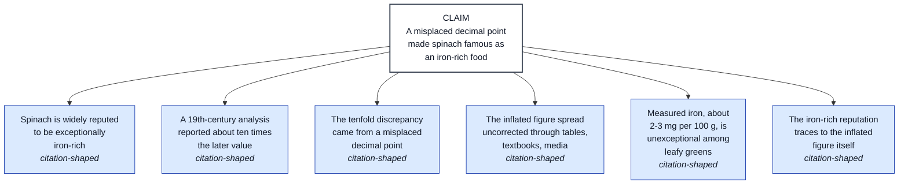
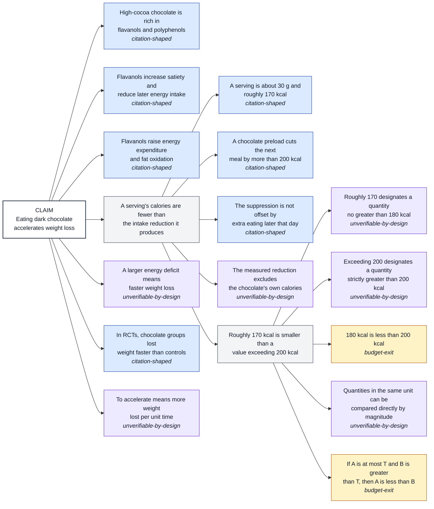

# The demo, explained

This directory is the demo's record: verbatim terminal output captured on
2026-08-17, the day of submission. Nothing here is mocked or hand-edited — each
file is the output of one command, and every command runs offline on a fresh
clone with no API key (recorded LLM answers and registry responses are
committed with the repo; the one live LLM call behind each claim's first-ever
decomposition cost a few cents and was recorded then). The code blocks below
are excerpts quoted from those files so the output can be read in place — the
.txt files remain the complete, untrimmed record. The root README's "See it
run" section has the commands to reproduce all of it.

## The two demo claims, and why these two

Demo claims are deliberately **verifiable and low-valence** — the repo's design
docs bar contested political claims from the demo until the machinery has
earned trust — and each claim was picked to carry a different part of the
story:

1. **"A misplaced decimal point made spinach famous as an iron-rich food."**
   The famous myth-about-a-myth of spinach's inflated iron content. This is
   the committed, replayable run: decomposition plus per-premise verification.
2. **"Eating dark chocolate accelerates weight loss."** The claim behind the
   2015 chocolate-hoax study — deliberately bad science, published, gone
   viral, retracted, and still cited. It carries the retraction story, and,
   as it turned out, the deepest recursion of the demo.

## How a run works

Every capture below sits on the same four-stage pipeline. **Decompose**: an
LLM proposes 3–7 premises that jointly entail the claim; each premise is
typed, and the descent recurses on types that warrant it, bounded by a depth
budget and a node cap, with every terminal recording *why* it stopped.
Malformed proposals are refused and counted, never silently repaired.
**Verify**: a locally-run entailment model (DeBERTa-v3, run on this machine —
no API) scores every decomposition step; the score ships labeled
*uncalibrated* and the render prints the model's known misses beside its
numbers. **Bind**: any identifier a premise carries (DOI, PMID) is resolved
against scholarly registries. **Ground**: a bound identifier is looked up in
the alethiology — the store of verified facts — by exact key. Then the run is
stored and rendered.

## The captures, file by file

### `00-store-build.txt` — building the fact store

Two commands. `verity.alethiology seed` loads 33 curated facts (19 about the
spinach story, 14 about the chocolate hoax; 30 keyed by DOI, 3 by PMID)
against committed records of what each registry returned. The interesting part
is what the gate **refused to take at face value**: six facts requested
"verified-primary" status and were *downgraded* to "single-secondary" because
the registries disagree about what work DOI `10.3823/1654` even is —
Retraction Watch says *"Chocolate with high Cocoa content as a weight-loss
accelerator"*, while Crossref and OpenAlex both return a completely different
paper (*"The comparison of resilience and spirituality in addicted and
non-addicted women"*). That is a real data-integrity problem in the world's
scholarly infrastructure, surfaced and recorded by the seed gate instead of
papered over: the capture lists all four affected rows under "work-identity
mismatches."

Then `verity.quality apply` checks all 19 identifiers in the store against
three retraction sources — Retraction Watch's bulk table, Crossref's
update metadata, and OpenAlex's `is_retracted` flag — and writes the result
onto each fact. Final tally, printed in the capture: **27 facts clean, 6
flagged retracted** (five resting on the chocolate-hoax DOI, one on a
retracted hesperidin trial, PMID 31844967).

```text
rows:            33
  by scope:      {'chocolate-hoax': 14, 'spinach-iron': 19}
  by key type:   {'doi': 30, 'pmid': 3}
  by tier:       {'single-secondary': 6, 'verified-primary': 27}
grounding-eligible facts: 27
...
  clean: 27, retracted: 6, unchanged: 33
```
 Two subtleties visible in the
output: two papers carry Crossref *correction* notices that the checker
correctly reports as `notice-not-retraction` rather than lumping them in with
retractions, and PMID-keyed facts show `crossref — crossref indexes DOIs, and
this is a pmid` — the checker says what each source *could not* answer instead
of silently skipping it. The tool ends by printing its own scope caveat: this
is a labelled partial of the full retraction tier, and a flagged fact does
not yet propagate its flag to premises standing on it.

### `01-retraction-check.txt` — one identifier, three sources

The same check pointed at a single identifier: `verity.quality check
doi:10.3823/1654`. The whole verdict block:

```text
doi:10.3823/1654  retracted
  crossref          retracted  (updated-by=retraction source=retraction-watch record-id=17524)
  openalex          retracted  (is_retracted=true)
  retraction-watch  retracted  (nature=Retraction record-id=17524 table=data/retraction_watch.csv)
  a registry check cites record-id=17524 — that is a Retraction Watch record seen again, not a second source
```

The last line is the one that keeps the agreement honest.

Crossref's retraction notice for this DOI is itself sourced from Retraction
Watch (same record id), and OpenAlex ingests Crossref — so "three sources
agree" here means three sources were *consulted*, and the tool says so rather
than claiming independent corroboration it doesn't have.

### `02-spinach-render.txt` — the committed run

The premise tree for the spinach claim, rendered from the committed graph
(`data/demo/spinach.json`). How to read it: the header states **"Verity issues
no verdict on this claim. Every number below scores one step"** — that line is
the product's core design decision, printed on every render. Each premise row
shows the step's entailment score (`0.9995` here, tilde-marked as
uncalibrated), a `Δ if removed` column (unmeasured yet — shown as `—` rather
than faked), an evidence state, and a grounding status.

The shape of the tree first — premises paraphrased for the diagram; the table
beneath carries the verbatim premise text and the per-row numbers, keyed to
the same node labels.



> **CLAIM** — A misplaced decimal point made spinach famous as an iron-rich food.
> Verity issues no verdict on this claim. Every number below scores one step.

| Node | Premise (verbatim) | Terminal | Step entail. |
| --- | --- | --- | --- |
| P1 | Spinach is widely reputed in popular culture and nutrition writing to be an exceptionally rich dietary source of iron. | citation-shaped | 0.9995 ~ |
| P2 | A nineteenth-century published chemical analysis reported spinach's iron content as roughly ten times the value obtained by later analyses. | citation-shaped | 0.9995 ~ |
| P3 | The tenfold discrepancy in the published spinach iron figure originated from a decimal point being placed one position to the right of its correct location. | citation-shaped | 0.9995 ~ |
| P4 | The inflated spinach iron figure was reproduced in subsequent food composition tables, textbooks, and popular media rather than being corrected before wide circulation. | citation-shaped | 0.9995 ~ |
| P5 | Spinach's measured iron content, about 2 to 3 milligrams per 100 grams fresh weight, is comparable to that of many other leafy vegetables and not exceptional. | citation-shaped | 0.9995 ~ |
| P6 | Spinach's public reputation as an iron-rich food arose from the circulated inflated iron figure rather than from independent observation or promotion. | citation-shaped | 0.9995 ~ |

Every row in this run carries the same three remaining columns: **Δ if
removed** is empty, **evidence state** is `unverified*`, and **grounding** is
`not grounded`.

6 premises · 6 rows · 1 step · graph depth 1 (traversal depth) ·
alethiology read 2026-08-17 19:08Z

The result, honestly: **six premises, one step, depth 1, and nothing
grounds.** All six premises terminated `citation-shaped` (they are the kind of
statement a citation could settle — which makes them grounding targets, not
recursion candidates), and the binding stage reports `no-candidate-key 6`: the
decomposer volunteered no DOI or PMID, so there was nothing to look up in the
store. The footer is worth reading in full — the verifier prints its own
selection record (of 7 corruption families in its smoke set, it catches 2,
splits on 2, misses 3) and the sentence that keeps its high scores honest:
*"A high score means the step was not caught, not that the step is that
likely to hold."*

### `03-replay.txt` — reproducibility, with no key present

`verity replay` re-derives the committed run from its manifest: the clock is
pinned, the recorded LLM answers are replayed, the stage cache is off, and
each stage's output digest is compared against the stored run. The capture
shows all four stage digests matching and the verdict **`reproduced`** — with
`ANTHROPIC_API_KEY` unset and the working caches moved aside, so every answer
demonstrably came from the committed recordings.

```text
  = decompose  72d9603b267ca2f3c7aa5f8514c5fb3424ca866ca8ece08bd9cd39cef4776f35
  = verify     89af5e77714bd0b70fc1f005b2cc102b32e3d27e1984f1bae10f6cbe051142b5
  = bind       89af5e77714bd0b70fc1f005b2cc102b32e3d27e1984f1bae10f6cbe051142b5
  = ground     a78eb018d000f40be2e5f64055041b96cdc7eb4c2e398ab91e9ae0036f225244
  ...
  reproduced
```

One printed note is worth noticing: the replay says the store it read was
overridden relative to the one the run recorded — the tool reports the
substitution rather than letting it pass silently.

### `04-chocolate-attempt.txt` — the deepest tree, and the honest miss

The chocolate claim produced the demo's richest decomposition: **17 premises
across 3 steps, recursing to depth 3.** The recursion is visible in the
capture — the premise "the calories a serving supplies are fewer than the
intake reduction it produces" breaks down into a sub-tree of measurable
statements, and the comparison itself bottoms out in premises like *"180
kilocalories is less than 200 kilocalories"* and the general rule *"if A is
no greater than T and B is strictly greater than T, then A is less than B"*.
The termination accounting is printed beside the tree: 2 branches stopped at
the depth budget (`budget-exit`), 7 at citation-shaped statements, 6 at
statements marked `unverifiable-by-design` (definitions and arithmetic that
no citation could or should settle).

The shape of the tree first — premises paraphrased for the diagram and
color-coded by why each branch stopped (blue: a citation could settle it;
purple: unverifiable by design — definitions and arithmetic; amber: the depth
budget stopped it). The table beneath carries the verbatim premise text and
the per-row numbers, keyed to the same node labels.



> **CLAIM** — Eating dark chocolate accelerates weight loss.
> Verity issues no verdict on this claim. Every number below scores one step.

| Node | Premise (verbatim) | Terminal | Step entail. |
| --- | --- | --- | --- |
| P1 | Dark chocolate with a high cocoa solids content contains cocoa flavanols and other polyphenols at concentrations substantially greater than those in milk chocolate. | citation-shaped | 0.999 ~ |
| P2 | Ingestion of cocoa flavanols increases satiety and reduces ad libitum energy intake at subsequent meals in controlled feeding studies. | citation-shaped | 0.999 ~ |
| P3 | Cocoa flavanol intake increases resting energy expenditure and whole-body fat oxidation in human metabolic measurements. | citation-shaped | 0.999 ~ |
| P4 | For a typical serving of dark chocolate, the calories it supplies are fewer than the reduction in total daily energy intake that its consumption produces. | *expanded* | 0.999 ~ |
| Q1 | ↳ A typical serving of dark chocolate is about 30 grams and supplies roughly 170 kilocalories. | citation-shaped | 0.9995 ~ |
| Q2 | ↳ In controlled feeding studies, consuming a serving of dark chocolate as a preload lowers energy intake at the following meal by more than 200 kilocalories compared with no preload. | citation-shaped | 0.9995 ~ |
| Q3 | ↳ The suppression of food intake that follows dark chocolate consumption is not offset by extra eating during the remainder of the same day. | citation-shaped | 0.9995 ~ |
| Q4 | ↳ The measured reduction in total daily energy intake attributed to dark chocolate consumption is calculated from intake of foods other than the chocolate itself. | unverifiable-by-design | 0.9995 ~ |
| Q5 | ↳ A value of roughly 170 kilocalories is smaller than a value exceeding 200 kilocalories. | *expanded* | 0.9995 ~ |
| R1 | ↳↳ The phrase "roughly 170 kilocalories" designates a quantity no greater than 180 kilocalories. | unverifiable-by-design | 0.998 ~ |
| R2 | ↳↳ The phrase "a value exceeding 200 kilocalories" designates a quantity strictly greater than 200 kilocalories. | unverifiable-by-design | 0.998 ~ |
| R3 | ↳↳ 180 kilocalories is less than 200 kilocalories. | budget-exit | 0.998 ~ |
| R4 | ↳↳ Two quantities both expressed in kilocalories are measured on the same scale and can be compared directly by magnitude. | unverifiable-by-design | 0.998 ~ |
| R5 | ↳↳ For any quantities A and B and threshold T, if A is no greater than T and B is strictly greater than T, then A is less than B. | budget-exit | 0.998 ~ |
| P5 | A larger daily energy deficit, produced by lower energy intake combined with higher energy expenditure, results in a faster rate of body weight loss over time. | unverifiable-by-design | 0.999 ~ |
| P6 | In randomized controlled trials of adults following a reduced-calorie diet, groups assigned to consume dark chocolate daily lost body weight at a greater rate than control groups consuming no dark chocolate. | citation-shaped | 0.999 ~ |
| P7 | To accelerate weight loss means to increase the amount of body weight lost per unit of time relative to a comparison condition. | unverifiable-by-design | 0.999 ~ |

Every row in this run carries the same three remaining columns: **Δ if
removed** is empty, **evidence state** is `unverified*`, and **grounding** is
`not grounded`.

17 premises · 17 rows · 3 steps · graph depth 3 (traversal depth) ·
alethiology read 2026-08-17 19:22Z

*note* — the descent expanded 2 of 17 premises to depth 3 against a budget of
3; terminals: 2 budget-exit, 7 citation-shaped, 6 unverifiable-by-design.

### `03-replay.txt` — reproducibility, with no key present

`verity replay` re-derives the committed run from its manifest: the clock is
pinned, the recorded LLM answers are replayed, the stage cache is off, and
each stage's output digest is compared against the stored run. The capture
shows all four stage digests matching and the verdict **`reproduced`** — with
`ANTHROPIC_API_KEY` unset and the working caches moved aside, so every answer
demonstrably came from the committed recordings.

```text
  = decompose  72d9603b267ca2f3c7aa5f8514c5fb3424ca866ca8ece08bd9cd39cef4776f35
  = verify     89af5e77714bd0b70fc1f005b2cc102b32e3d27e1984f1bae10f6cbe051142b5
  = bind       89af5e77714bd0b70fc1f005b2cc102b32e3d27e1984f1bae10f6cbe051142b5
  = ground     a78eb018d000f40be2e5f64055041b96cdc7eb4c2e398ab91e9ae0036f225244
  ...
  reproduced
```

One printed note is worth noticing: the replay says the store it read was
overridden relative to the one the run recorded — the tool reports the
substitution rather than letting it pass silently.

### `04-chocolate-attempt.txt` — the deepest tree, and the honest miss

The chocolate claim produced the demo's richest decomposition: **17 premises
across 3 steps, recursing to depth 3.** The recursion is visible in the
capture — the premise "the calories a serving supplies are fewer than the
intake reduction it produces" breaks down into a sub-tree of measurable
statements, and the comparison itself bottoms out in premises like *"180
kilocalories is less than 200 kilocalories"* and the general rule *"if A is
no greater than T and B is strictly greater than T, then A is less than B"*.
The termination accounting is printed beside the tree: 2 branches stopped at
the depth budget (`budget-exit`), 7 at citation-shaped statements, 6 at
statements marked `unverifiable-by-design` (definitions and arithmetic that
no citation could or should settle).

The shape of the tree first — premises paraphrased for the diagram and
color-coded by why each branch stopped (blue: a citation could settle it;
purple: unverifiable by design — definitions and arithmetic; amber: the depth
budget stopped it). The table beneath carries the verbatim premise text and
the per-row numbers, keyed to the same node labels.


> **CLAIM** — Eating dark chocolate accelerates weight loss.
> Verity issues no verdict on this claim. Every number below scores one step.

| Node | Premise (verbatim) | Terminal | Step entail. |
| --- | --- | --- | --- |
| P1 | Dark chocolate with a high cocoa solids content contains cocoa flavanols and other polyphenols at concentrations substantially greater than those in milk chocolate. | citation-shaped | 0.999 ~ |
| P2 | Ingestion of cocoa flavanols increases satiety and reduces ad libitum energy intake at subsequent meals in controlled feeding studies. | citation-shaped | 0.999 ~ |
| P3 | Cocoa flavanol intake increases resting energy expenditure and whole-body fat oxidation in human metabolic measurements. | citation-shaped | 0.999 ~ |
| P4 | For a typical serving of dark chocolate, the calories it supplies are fewer than the reduction in total daily energy intake that its consumption produces. | *expanded* | 0.999 ~ |
| Q1 | ↳ A typical serving of dark chocolate is about 30 grams and supplies roughly 170 kilocalories. | citation-shaped | 0.9995 ~ |
| Q2 | ↳ In controlled feeding studies, consuming a serving of dark chocolate as a preload lowers energy intake at the following meal by more than 200 kilocalories compared with no preload. | citation-shaped | 0.9995 ~ |
| Q3 | ↳ The suppression of food intake that follows dark chocolate consumption is not offset by extra eating during the remainder of the same day. | citation-shaped | 0.9995 ~ |
| Q4 | ↳ The measured reduction in total daily energy intake attributed to dark chocolate consumption is calculated from intake of foods other than the chocolate itself. | unverifiable-by-design | 0.9995 ~ |
| Q5 | ↳ A value of roughly 170 kilocalories is smaller than a value exceeding 200 kilocalories. | *expanded* | 0.9995 ~ |
| R1 | ↳↳ The phrase "roughly 170 kilocalories" designates a quantity no greater than 180 kilocalories. | unverifiable-by-design | 0.998 ~ |
| R2 | ↳↳ The phrase "a value exceeding 200 kilocalories" designates a quantity strictly greater than 200 kilocalories. | unverifiable-by-design | 0.998 ~ |
| R3 | ↳↳ 180 kilocalories is less than 200 kilocalories. | budget-exit | 0.998 ~ |
| R4 | ↳↳ Two quantities both expressed in kilocalories are measured on the same scale and can be compared directly by magnitude. | unverifiable-by-design | 0.998 ~ |
| R5 | ↳↳ For any quantities A and B and threshold T, if A is no greater than T and B is strictly greater than T, then A is less than B. | budget-exit | 0.998 ~ |
| P5 | A larger daily energy deficit, produced by lower energy intake combined with higher energy expenditure, results in a faster rate of body weight loss over time. | unverifiable-by-design | 0.999 ~ |
| P6 | In randomized controlled trials of adults following a reduced-calorie diet, groups assigned to consume dark chocolate daily lost body weight at a greater rate than control groups consuming no dark chocolate. | citation-shaped | 0.999 ~ |
| P7 | To accelerate weight loss means to increase the amount of body weight lost per unit of time relative to a comparison condition. | unverifiable-by-design | 0.999 ~ |

Every row in this run carries the same three remaining columns: **Δ if
removed** is empty, **evidence state** is `unverified*`, and **grounding** is
`not grounded`.

17 premises · 17 rows · 3 steps · graph depth 3 (traversal depth) ·
alethiology read 2026-08-17 19:22Z

*note* — the descent expanded 2 of 17 premises to depth 3 against a budget of
3; terminals: 2 budget-exit, 7 citation-shaped, 6 unverifiable-by-design.

And the miss, kept deliberately: `no-candidate-key 17`. The decomposer
volunteered no identifier on any premise, so nothing bound, nothing grounded —
and the tree never touches the retracted chocolate-hoax DOI sitting six rows
deep in the very store this run read from. Grounding currently depends on the
decomposer happening to volunteer an identifier (two of the ten recorded
decompositions did), and this capture shows what a miss looks like instead of
re-rolling until it looked better. The retraction story therefore lives in
captures `00` and `01`, where it is systematic rather than luck-dependent.

## What the demo establishes — and what it doesn't

**Establishes:** the pipeline runs end to end on real claims; every premise
carries its own score from a verifier that prints its own blind spots;
recursion is bounded and every stop is accounted for; the retraction check
consults three sources and names shared provenance instead of inflating
agreement; the seed gate downgrades facts when registries disagree; and the
committed run reproduces byte-for-byte offline, key-free, on anyone's machine.

**Does not establish:** any evaluation result — the pre-registered thresholds
in `docs/evaluation.md` are unmeasured and every number here is a smoke test;
grounding — no capture shows a premise resolving against the store, because
no run in the demo window volunteered an identifier; calibration — the
verifier's scores are explicitly unanchored; and propagation — a retracted
fact does not yet flip the premises standing on it (that layer is designed,
not built).
